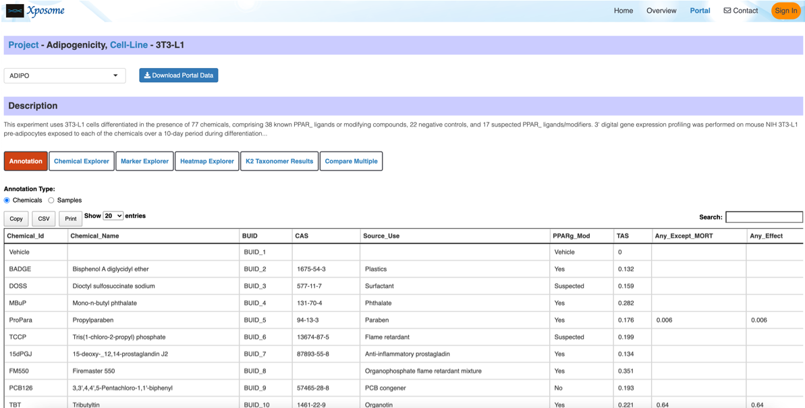
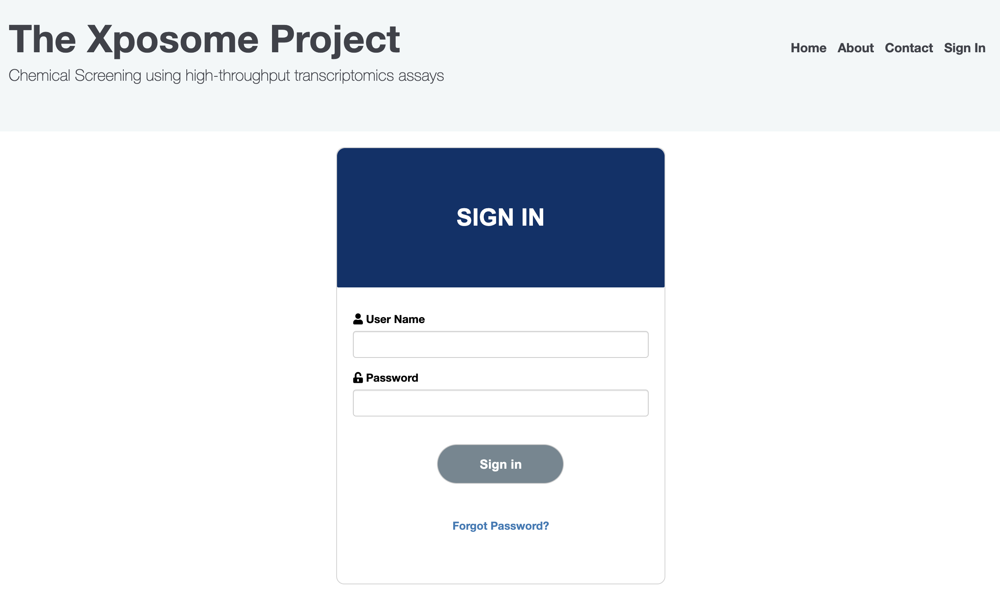

---
output:
  flexdashboard::flex_dashboard:
    orientation: rows
    vertical_layout: scroll
    theme: bootstrap
    css:
    - www/style.css
    - www/docsearch.css
    - www/bootstrap-toc.css
    favicon: https://github.com/apple-touch-icon.png
    includes:
      in_header: www/header.html
      after_body: www/footer.html
  
---

```{r setup, include=FALSE}
library(rmarkdown)
library(shiny)

version= "0.0.0.1"

my_title <- paste0("<span><a class='navbar-link' href='#home'><strong>Xposome</strong></a>&ensp;<span class='version-label label-default' data-toggle='tooltip' data-placement='bottom' title='Released version'>", version, "</span></span>")
```

---
title: '`r htmltools::HTML(my_title)`'
---

<script type="text/javascript">
    $(document).ready(function() {
        document.title = "Xposome";
    });
</script>

<strong>Home</strong> {data-icon="fa-home"}
=====================================

```{r mainpage}

htmltools::HTML(paste0('
<div class="row">
<!------------------------------------- contents: end ------------------------------->
<div class="contents col-md-9"> 

<!-- badges: start -->
<p><a href="https://www.tidyverse.org/lifecycle/#experimental"></a></p>
<!-- badges: end -->

<!-- introduction: start -->
<h4>Introduction</h4>

<p><span style="color: #377eb8; font-size: 16px;"><strong>Xposome</strong></span> is a project that aims to build a repository of gene expression datasets that profile the transcriptomic response to exposure of known toxins.</p>
<!-- introduction: end -->

<br>

<!-- installation: start -->
<h4>Installation</h4>
<p>To run the Xposome application locally: 
<ul>
  <li>
    Download the source code from the <a href="https://github.com/montilab/Xposome">Github repo</a>
  </li>
  <li>
    Navigate to the <span class="highlight-text">shinyApps</span> directory and open <span class="highlight-text">app.R</span> within that directory
  </li>
  <li>
    The file will open in Rstudio. Click <span class="highlight-text">"run app"</span> button to run the application
  </li>
</ul>
</p>
<!-- installation: end -->

<br>

<!-- dockerize application: start -->
<h4>Dockerize Xposome</h4>
<p>To build a docker container for Xposome:
<ul>
  <li>
    Download the source code from the <a href="https://github.com/montilab/Xposome">Github repo</a>
  </li>
  <li>
    Navigate to the <span class="highlight-text">Xposome</span> directory where the dockerfile is stored. Run the following command to build a docker image for Xposome.
    <div class="code">docker build xposome:latest .</div>
    To check if the image is built succesfully,
     <div class="code">docker images </div>   
  </li>
  <li>
    After the image is built, you can publish the image as follows:
    <div class="code">docker run -d -p 3838:3838 \ <br>
    &emsp; -v shinyApps/:/srv/shiny-server/ \ <br>
    &emsp; -v shinyApps-log/:/var/log/shiny-server/ \ <br>
    &emsp; xposome:latest
   </div>
   <br>
   -d is to run the container in detached mode <br>
   -v is to expose a directory on the host to the container <span class="highlight-text">&lt;host_dir&gt;:&lt;container_dir&gt;</span> <br>
   -p is to specify container to listen on the host port <span class="highlight-text">&lt;host_port&gt;:&lt;container_port&gt;</span> <br>
   <br>
   To check if the container is running,
   <div class="code">docker container ps</div>
  </li>
  <li>
    Once the app is up and running, you can visit <span class="highlight-text">http://localhost:3838</span> to see that the application is hosted there.
  </li>
</ul>
The image is also available from <a href="">Docker Hub</a>. To pull the image,
<div class="code">docker pull montibot/Xposome</div>
<p>
<!-- dockerize application: end -->

<br>

<!-- app usage: start -->
<h4>App Usage</h4>
<p>There are two main parts of the application:
  <ul>
  <li>
    The portal page
  </li>
  <li>
    The moderator page
  </li>
</ul>
</p>

<br>

<h4>The Portal Page</h4>
<p>Contains a list of the chemical screenings that were exposed to high-throughput transcriptomics assays.</p>


<br><br>

<h4>The Moderator Page</h4>
<p>Requires user access and can upload new screenings to the portal. The default credentials: <br>
Username: Xposome <br>
Password: Xposome <br>
</p>

<!-- app usage: end -->

<br><br>

</div> 
<!------------------------------------- contents: end ------------------------------->

<!------------------------------------- links: start ------------------------------->

<div class="col-md-3 hidden-xs hidden-sm" id="pkgdown-sidebar"> 

<div class="links">
<h2>Links</h2>
<ul class="list-unstyled">
  <li>Browse source code at <br><a href="https://github.com/montilab/carcinogenome-docker/"><strong style="color: #1f78b4">https://github.com/montilab/Xposome/</strong></a>
  </li>
</ul>
</div>

<div class="license">
<h2>License</h2>
<ul class="list-unstyled">
<li>
<a href="https://www.r-project.org/Licenses/GPL-3"><strong style="color: #1f78b4">GPL-3</strong></a> + file <a href="LICENSE-text.html"><strong style="color: #1f78b4">LICENSE</strong></a>
</li>
</ul>
</div>

<div class="developers">
<h2>Developers</h2>
<ul class="list-unstyled">
<li><strong style="color: #1f78b4">Reina Chau</strong><br><small class="roles"> Author, maintainer </small>  </li>
<li><strong style="color: #1f78b4">Stefano Monti</strong><br><small class="roles"> Author </small>  </li>
</ul>
</div>

</div>
<!------------------------------------- links: end------------------------------->
</div>

'))

```

<strong>NGINX and Docker-compose</strong> {data-navmenu="Docs"}
=====================================  


```{r docker-compose}

fluidRow(
  style="padding: 0 20px 0 20px;",
  
  column(
    width=9, 
    includeMarkdown("documentation/docker-compose.Rmd")
  ),
  column(
    width=3, class="col-md-3 hidden-xs hidden-sm", id="pkgdown-sidebar",
    HTML('
    <div class="links">
    <h2>Links</h2>
    <ul class="list-unstyled">
      <li>Browse source code at <br><a href="https://github.com/montilab/carcinogenome-docker/"><strong style="color: #1f78b4">https://github.com/montilab/Xposome/</strong></a>
      </li>
    </ul>
    </div>
    
    <div class="license">
    <h2>License</h2>
    <ul class="list-unstyled">
    <li>
    <a href="https://www.r-project.org/Licenses/GPL-3"><strong style="color: #1f78b4">GPL-3</strong></a> + file <a href="LICENSE-text.html"><strong style="color: #1f78b4">LICENSE</strong></a>
    </li>
    </ul>
    </div>
    
    <div class="developers">
    <h2>Developers</h2>
    <ul class="list-unstyled">
    <li><strong style="color: #1f78b4">Reina Chau</strong><br><small class="roles"> Author, maintainer </small>  </li>
    <li><strong style="color: #1f78b4">Stefano Monti</strong><br><small class="roles"> Author </small>  </li>
    </ul>
    </div>'
    )
  )
)
  
```

<strong>Set Up Postfix</strong> {data-navmenu="Docs"}
=====================================  

```{r set-up postfix}

fluidRow(
  style="padding: 0 20px 0 20px;",
  
  column(
    width=9, 
    "Coming soon"
  ),
  column(
    width=3, class="col-md-3 hidden-xs hidden-sm", id="pkgdown-sidebar",
    HTML('
    <div class="links">
    <h2>Links</h2>
    <ul class="list-unstyled">
      <li>Browse source code at <br><a href="https://github.com/montilab/carcinogenome-docker/"><strong style="color: #1f78b4">https://github.com/montilab/Xposome/</strong></a>
      </li>
    </ul>
    </div>
    
    <div class="license">
    <h2>License</h2>
    <ul class="list-unstyled">
    <li>
    <a href="https://www.r-project.org/Licenses/GPL-3"><strong style="color: #1f78b4">GPL-3</strong></a> + file <a href="LICENSE-text.html"><strong style="color: #1f78b4">LICENSE</strong></a>
    </li>
    </ul>
    </div>
    
    <div class="developers">
    <h2>Developers</h2>
    <ul class="list-unstyled">
    <li><strong style="color: #1f78b4">Reina Chau</strong><br><small class="roles"> Author, maintainer </small>  </li>
    <li><strong style="color: #1f78b4">Stefano Monti</strong><br><small class="roles"> Author </small>  </li>
    </ul>
    </div>'
    )
  )
)
  
```

<strong>Reference</strong> {data-icon="fa-list"}
=====================================

```{r Reference}

fluidRow(
  style="padding: 0 20px 0 20px;",
  
  column(
    width=9, 
    "Coming soon"
  ),
  column(
    width=3, class="col-md-3 hidden-xs hidden-sm", id="pkgdown-sidebar",
    HTML('
    <div class="links">
    <h2>Links</h2>
    <ul class="list-unstyled">
      <li>Browse source code at <br><a href="https://github.com/montilab/carcinogenome-docker/"><strong style="color: #1f78b4">https://github.com/montilab/Xposome/</strong></a>
      </li>
    </ul>
    </div>
    
    <div class="license">
    <h2>License</h2>
    <ul class="list-unstyled">
    <li>
    <a href="https://www.r-project.org/Licenses/GPL-3"><strong style="color: #1f78b4">GPL-3</strong></a> + file <a href="LICENSE-text.html"><strong style="color: #1f78b4">LICENSE</strong></a>
    </li>
    </ul>
    </div>
    
    <div class="developers">
    <h2>Developers</h2>
    <ul class="list-unstyled">
    <li><strong style="color: #1f78b4">Reina Chau</strong><br><small class="roles"> Author, maintainer </small>  </li>
    <li><strong style="color: #1f78b4">Stefano Monti</strong><br><small class="roles"> Author </small>  </li>
    </ul>
    </div>'
    )
  )
)